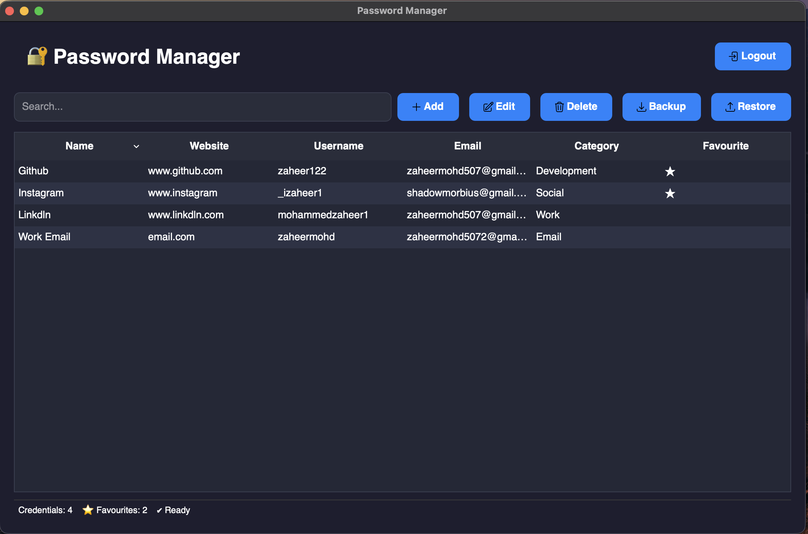

# 🔐 Password Manager

> A secure, modern desktop password manager built with Python and PySide6, designed to securely store, manage, generate, and back up credentials using encrypted local storage.

<p align="center">
  
</p>

<p align="center">
  <b>Secure your credentials. Generate stronger passwords. Stay in control.</b>
</p>

<p align="center">


</p>

---

## 📌 Overview

Password Manager is a desktop application designed to provide a secure and convenient way to manage online credentials.

Instead of storing passwords in plain text, the application encrypts credential passwords before storing them in the local SQLite database.

The application provides a complete credential-management workflow:

- 🔐 Master password authentication
- 🔒 Encrypted credential storage
- ➕ Add credentials
- ✏️ Edit credentials
- 🗑️ Delete credentials
- 👁️ View and reveal passwords
- 📋 Copy passwords to clipboard
- 🔎 Search credentials
- ⭐ Favourite credentials
- 🎲 Secure password generation
- 💾 Backup vault
- ♻️ Restore vault
- 🚪 Logout
- 🖥️ Modern PySide6 desktop interface

The project is being developed with a strong focus on **security, clean architecture, usability, and real-world software engineering practices**.

---

# ✨ Features

## 🔐 Master Password Authentication

The application uses a master password to protect access to the vault.

The master password is **not stored directly**.

Instead, authentication uses a password hashing mechanism with a cryptographic salt.

```text
Master Password
       │
       ▼
Password Hashing
       │
       ▼
Salt + Password Hash
       │
       ▼
Authentication

🔒 Encrypted Password Storage

Credential passwords are encrypted before being stored in the SQLite database.

User Password
      │
      ▼
Encryption Manager
      │
      ▼
Encrypted Password
      │
      ▼
SQLite Database

When the credential is viewed, the application decrypts the password using the appropriate encryption key.

➕ Add Credentials

Users can create credentials containing:

Name
Website
Username
Email
Password
Category
Notes
Favourite status

The Add Credential dialog also includes password generation functionality.

🎲 Password Generator

The application includes a built-in password generator for creating stronger passwords.

Users can generate passwords directly while creating or editing a credential.

This avoids the need to use an external password-generation website or application.

🔎 Search Credentials

The dashboard provides credential searching.

Users can quickly search their vault instead of manually looking through every stored credential.

Search results update dynamically as the user types.

👁️ View Credentials

Users can open a credential to view its details.

Password fields are hidden by default.

The user can:

Show the password
Hide the password
Copy the password
Edit the credential
Close the credential view
⭐ Favourite Credentials

Frequently used credentials can be marked as favourites.

Favourite status is displayed directly in the dashboard.

Example:

GitHub       github.com       ⭐
Google       google.com
AWS          aws.amazon.com   ⭐
✏️ Edit Credentials

Existing credentials can be edited without creating a new credential.

Users can update:

Name
Website
Username
Email
Password
Category
Notes
Favourite status
🗑️ Delete Credentials

Credentials can be deleted from the vault.

Before deletion, the application asks the user to confirm the action.

Delete "GitHub"?

        [Cancel]     [Delete]

This helps prevent accidental deletion.

💾 Backup & Restore

The application supports backing up and restoring credentials.

Backup

The Backup feature exports the vault information into a JSON backup file.

Vault
  │
  ▼
Backup Manager
  │
  ▼
JSON Backup

Example:

backups/
└── backup_2026-07-26_23-41-37.json

Credential passwords remain encrypted in the backup.

Restore

Users can select an existing .json backup through the application's file picker.

JSON Backup
     │
     ▼
Backup Manager
     │
     ▼
Vault

The dashboard is refreshed after restoration.

⚠️ Backup files contain sensitive vault information and must be protected. They should never be committed to a public Git repository.

🖥️ Dashboard

The application uses PySide6 for the desktop interface.

The dashboard currently provides:

Credential table
Search
Add credential
Edit credential
Delete credential
View credential
Backup
Restore
Favourite indicators
Password details
Logout
Status bar
Application icons
Sorting
Credential selection

🏗️ Architecture

The project is organized into separate layers for authentication, encryption, database operations, vault management, backup handling, and user interface components.

                       ┌───────────────────┐
                       │      PySide6      │
                       │     Desktop UI    │
                       └─────────┬─────────┘
                                 │
                                 ▼
                       ┌───────────────────┐
                       │   Vault Manager   │
                       │ Application Logic │
                       └─────────┬─────────┘
                                 │
                ┌────────────────┴────────────────┐
                │                                 │
                ▼                                 ▼
       ┌─────────────────┐              ┌─────────────────┐
       │    Encryption   │              │    Database     │
       │     Manager     │              │     Manager     │
       └────────┬────────┘              └────────┬────────┘
                │                                 │
                └────────────────┬────────────────┘
                                 ▼
                         ┌───────────────┐
                         │ SQLite Vault  │
                         └───────────────┘
📂 Project Structure
PasswordManager/
│
├── auth/
│   ├── __init__.py
│   ├── auth_manager.py
│   └── session.py
│
├── backup/
│   ├── __init__.py
│   └── backup_manager.py
│
├── database/
│   ├── __init__.py
│   ├── db_manager.py
│   └── schema.py
│
├── encryption/
│   ├── __init__.py
│   ├── encryption_manager.py
│   ├── password_hasher.py
│   └── salt_manager.py
│
├── models/
│   ├── __init__.py
│   └── credential.py
│
├── services/
│   └── __init__.py
│
├── ui/
│   ├── __init__.py
│   ├── dashboard_window.py
│   ├── login_window.py
│   ├── register_window.py
│   ├── vault_window.py
│   ├── icon_loader.py
│   ├── styles.py
│   │
│   └── dialog/
│       ├── add_dialog.py
│       └── view_dialog.py
│
├── utils/
│   ├── __init__.py
│   └── password_generator.py
│
├── vault/
│   └── vault_manager.py
│
├── assets/
│
├── tests/
│
├── main.py
├── requirements.txt
├── .gitignore
└── README.md

The exact contents of the project may evolve as new features are added.

🛠️ Technology Stack
Technology	Purpose
Python	Core programming language
PySide6	Desktop graphical user interface
SQLite	Local database
Cryptography	Credential encryption
Password Hashing	Master password authentication
JSON	Backup format
Git	Version control
GitHub	Source code hosting
🔐 Security Design

Security is a core consideration of this project.

The current design includes:

Master Password Protection

The master password is processed using password hashing and a cryptographic salt rather than being stored directly.

Credential Encryption

Stored credential passwords are encrypted before being written to the database.

Salt Management

Cryptographic salts are stored separately from the database.

Protected Password Display

Passwords are hidden by default in the graphical interface.

Secure Credential Handling

Credential operations are handled through the vault and database layers rather than allowing UI components to directly manipulate database records.

Sensitive Files

The following files should remain local and should not be committed to Git:

data/*.db
data/*.salt
backups/*
🧪 Testing

The project contains tests covering the major components of the application.

Examples include:

python test_auth.py
python test_database.py
python test_encryption.py
python test_vault_manager.py
python test_search.py
python test_update_credential.py
python test_delete_credential.py
python test_password_generator.py
python test_backup.py
python test_restore.py
python test_view_credentials.py

Testing currently covers areas such as:

Authentication
Database operations
Password hashing
Encryption and decryption
Credential creation
Credential retrieval
Credential updates
Credential deletion
Credential searching
Password generation
Backup
Restore
Credential viewing

The project is developed incrementally, with backend functionality being tested before integrating it into the graphical interface.

🚀 Installation
Requirements

Before running the application, make sure you have:

Python 3.10 or newer
Git
pip
1. Clone the repository
git clone https://github.com/zaheer122/PasswordManager.git

Then enter the project directory:

cd PasswordManager
2. Create a virtual environment
macOS / Linux
python3 -m venv venv

Activate it:

source venv/bin/activate
Windows
python -m venv venv

Activate it:

venv\Scripts\activate
3. Install dependencies
pip install -r requirements.txt
4. Run the application
python main.py
🧪 Running Tests

Activate the virtual environment first:

source venv/bin/activate

Then run the required test:

python test_auth.py

or any of the individual test files:

python test_database.py
python test_encryption.py
python test_vault_manager.py
python test_search.py
python test_update_credential.py
python test_delete_credential.py
python test_password_generator.py
python test_backup.py
python test_restore.py
python test_view_credentials.py
🔄 Application Workflow

The current application workflow is:

                 Start Application
                        │
                        ▼
               Master Password
                  Exists?
                 /        \
               No          Yes
               │            │
               ▼            ▼
          Registration     Login
               │            │
               ▼            ▼
          Create Vault   Verify Password
                            │
                            ▼
                        Unlock Vault
                            │
                            ▼
                        Dashboard
                            │
        ┌───────────┬───────┼────────┬───────────┐
        ▼           ▼       ▼        ▼           ▼
       Add         Edit   Delete   Search      Backup
        │           │       │        │           │
        └───────────┴───────┴────────┴───────────┘
                            │
                            ▼
                         Restore